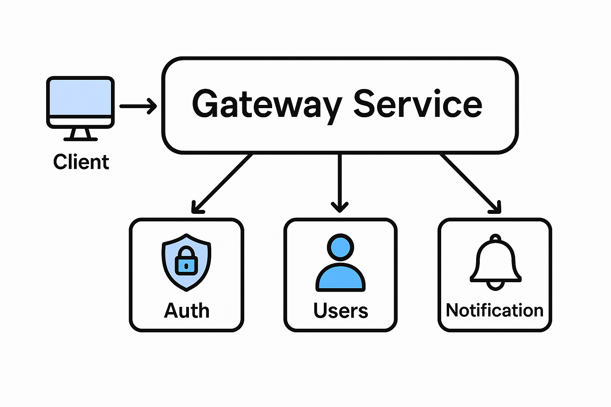

## Project setup , Compile and run the project

```bash
# Install all the dependencies
$ npm install

# development
$ npm run start

# watch mode
$ npm run start:dev

# production mode
$ npm run start:prod
```

## Run tests

```bash
# unit tests
$ npm run test

# e2e tests
$ npm run test:e2e

# test coverage
$ npm run test:cov
```
Yes! I can explain clearly how a **gateway service works** in a microservices architecture, especially in the context of NestJS.

---

## **1. Role of a Gateway Service**

A **gateway service** (often called an API Gateway) acts as the **single entry point** for all clients (web, mobile, or other services) to interact with backend microservices. It does **not contain all business logic** itself but routes requests to the appropriate microservices.

**Main responsibilities:**

1. **Routing:** Direct incoming requests to the correct microservice.
2. **Authentication & Authorization:** Verify tokens, API keys, or sessions before forwarding requests.
3. **Request Aggregation:** Combine data from multiple microservices and return a single response.
4. **Rate Limiting & Throttling:** Control the request load.
5. **Logging & Monitoring:** Track incoming requests, errors, and performance.
6. **Caching (optional):** Cache responses for frequently requested data.
7. **Protocol Translation:** Convert HTTP requests to gRPC, TCP, or messaging protocols for microservices.

---

## **2. How It Works in NestJS**

In NestJS, a gateway typically uses **ClientProxy** or **microservice transport layers** to communicate with backend services.

### **Flow of a Request**

1. Client sends a request to the gateway (HTTP or WebSocket).
2. Gateway checks **authentication & authorization** (via guards).
3. Gateway **validates the request** (via pipes and DTOs).
4. Gateway forwards the request to the **target microservice** using `ClientProxy`:

   ```ts
   this.authClient.send({ cmd: 'login' }, loginDto);
   ```
5. Microservice processes the request and sends a response back.
6. Gateway can **aggregate responses** if multiple microservices are involved.
7. Gateway applies **interceptors** (logging, transformation) and returns the final response to the client.

---

## **3. Benefits of a Gateway**

* **Centralized control**: Authentication, logging, rate limiting are handled in one place.
* **Simplified client experience**: Clients call a single endpoint rather than multiple microservices.
* **Decoupling**: Microservices are unaware of external clients and focus only on business logic.
* **Scalable**: You can scale the gateway independently from backend services.

---

## **4. Example in NestJS**

```ts
// gateway.service.ts
@Injectable()
export class GatewayService {
  constructor(
    @Inject('AUTH_SERVICE') private readonly authClient: ClientProxy,
    @Inject('NOTIFICATION_SERVICE') private readonly notificationClient: ClientProxy,
  ) {}

  async login(loginDto: LoginDto) {
    // Send request to Auth microservice
    const user = await this.authClient.send({ cmd: 'login' }, loginDto).toPromise();
    return user;
  }

  async sendNotification(notificationDto: NotificationDto) {
    // Forward request to Notification microservice
    return await this.notificationClient.send({ cmd: 'notify' }, notificationDto).toPromise();
  }
}
```

Here, the gateway **doesn’t handle the core business logic** but forwards requests to the correct microservice.

---

If you want, I can **draw a full diagram showing how a client interacts with the gateway and multiple microservices**. It will make the concept visually clear.

Do you want me to make that diagram?


```markdown
# Gateway Service - NestJS

This is a standard structure for a **Gateway Service** in a NestJS microservices architecture. This gateway acts as the entry point for all client requests and routes them to the appropriate microservices.

## Project Folder Structure


gateway-service/
├── src/
│   ├── main.ts                   # Entry point of the application
│   ├── app.module.ts             # Root module of the application
│   ├── app.controller.ts         # Optional default controller
│   ├── app.service.ts            # Optional default service
│   │
│   ├── config/                   # Configuration files
│   │   ├── config.module.ts      # Configuration module
│   │   ├── config.service.ts     # Config service (env variables)
│   │
│   ├── common/                   # Shared modules, interceptors, pipes, filters, guards
│   │   ├── interceptors/
│   │   ├── filters/
│   │   ├── guards/
│   │   ├── pipes/
│   │   └── decorators/
│   │
│   ├── modules/                  # Feature modules
│   │   ├── auth/                 # Authentication module
│   │   │   ├── auth.module.ts
│   │   │   ├── auth.controller.ts
│   │   │   ├── auth.service.ts
│   │   │   └── dto/
│   │   │
│   │   ├── users/                # Example users module
│   │   │   ├── users.module.ts
│   │   │   ├── users.controller.ts
│   │   │   ├── users.service.ts
│   │   │   └── dto/
│   │   │
│   │   └── gateway/              # Gateway-specific module to route requests to microservices
│   │       ├── gateway.module.ts
│   │       ├── gateway.controller.ts
│   │       └── gateway.service.ts
│   │
│   ├── microservices/            # Clients for microservices
│   │   ├── service-a.client.ts
│   │   ├── service-b.client.ts
│   │   └── microservice.module.ts
│   │
│   └── utils/                    # Utility functions
│       └── logger.ts
│
├── test/                         # Test folder
│   └── app.e2e-spec.ts
│
├── .env                          # Environment variables
├── .gitignore
├── nest-cli.json                  # NestJS CLI configuration
├── package.json
├── tsconfig.build.json
├── tsconfig.json
└── README.md


## Description of Key Folders

- **src/config**: Handles all environment configuration and app-wide settings.  
- **src/common**: Contains reusable logic like guards, interceptors, pipes, filters, and custom decorators.  
- **src/modules**: Each business feature gets its own module. Gateway module handles routing client requests to microservices.  
- **src/microservices**: Contains client setup for connecting to other microservices using TCP, gRPC, or other transport strategies.  
- **src/utils**: Utilities such as logger, helper functions, and constants.  

## Features

- Centralized **Gateway** for routing and load balancing.
- Microservice clients for communication with other services.
- Modular design for scalability.
- Shared `common` module for reusable code.
- Environment-based configuration.
- Support for authentication, logging, and request validation.

## Running the Application

```bash
# Install dependencies
npm install

# Start the application
npm run start:dev
````

## Recommended Microservice Communication

* **TCP**: Simple, synchronous communication.
* **gRPC**: Fast, contract-based communication.
* **RabbitMQ / Kafka**: For event-driven async communication.

```

This structure is designed for **scalability, modularity, and maintainability** in a microservices environment. You can expand modules, microservices clients, and utilities as your project grows.
```
Absolutely! In a **NestJS Gateway Service**, the flow generally looks like this:

---

## **Flow**

1. **Client Request**: A user/client sends a request to the Gateway API (HTTP REST endpoint).
2. **Gateway Controller**: The gateway receives the request and delegates it to the appropriate service (e.g., AuthService).
3. **Gateway Service**: The gateway service acts as a bridge to the microservice. It can communicate via:

   * **REST API** (HTTP calls)
   * **RabbitMQ (RMQ)** (message broker for async or RPC style)
4. **Microservice Response**: The microservice processes the request and returns a response to the gateway.
5. **Gateway Response**: The gateway sends the final response back to the client.

---

## **Example 1: Gateway → Auth Microservice via REST**

### **Gateway Service (HTTP)**

```ts
// src/modules/gateway/gateway.service.ts
import { Injectable, HttpService } from '@nestjs/common';
import { firstValueFrom } from 'rxjs';

@Injectable()
export class GatewayService {
  constructor(private readonly httpService: HttpService) {}

  async loginUser(data: { email: string; password: string }) {
    const response$ = this.httpService.post(
      'http://localhost:3001/auth/login', // Auth Service URL
      data,
    );
    const response = await firstValueFrom(response$);
    return response.data;
  }
}
```

### **Gateway Controller**

```ts
// src/modules/gateway/gateway.controller.ts
import { Controller, Post, Body } from '@nestjs/common';
import { GatewayService } from './gateway.service';

@Controller('auth')
export class GatewayController {
  constructor(private readonly gatewayService: GatewayService) {}

  @Post('login')
  async login(@Body() loginDto: { email: string; password: string }) {
    return this.gatewayService.loginUser(loginDto);
  }
}
```

---

## **Example 2: Gateway → Auth Microservice via RabbitMQ (RMQ)**

### **Gateway Module**

```ts
// src/microservices/microservice.module.ts
import { Module } from '@nestjs/common';
import { ClientsModule, Transport } from '@nestjs/microservices';
import { GatewayService } from '../modules/gateway/gateway.service';

@Module({
  imports: [
    ClientsModule.register([
      {
        name: 'AUTH_SERVICE',
        transport: Transport.RMQ,
        options: {
          urls: ['amqp://localhost:5672'],
          queue: 'auth_queue',
          queueOptions: { durable: false },
        },
      },
    ]),
  ],
  providers: [GatewayService],
  exports: [GatewayService],
})
export class MicroserviceModule {}
```

### **Gateway Service (RMQ)**

```ts
// src/modules/gateway/gateway.service.ts
import { Injectable, Inject } from '@nestjs/common';
import { ClientProxy } from '@nestjs/microservices';
import { lastValueFrom } from 'rxjs';

@Injectable()
export class GatewayService {
  constructor(@Inject('AUTH_SERVICE') private readonly authClient: ClientProxy) {}

  async loginUser(data: { email: string; password: string }) {
    // Sending a message to Auth service and waiting for a response
    return await lastValueFrom(this.authClient.send('login', data));
  }
}
```

### **Gateway Controller (same as before)**

```ts
// src/modules/gateway/gateway.controller.ts
import { Controller, Post, Body } from '@nestjs/common';
import { GatewayService } from './gateway.service';

@Controller('auth')
export class GatewayController {
  constructor(private readonly gatewayService: GatewayService) {}

  @Post('login')
  async login(@Body() loginDto: { email: string; password: string }) {
    return this.gatewayService.loginUser(loginDto);
  }
}
```

---

## **Auth Microservice Example (RMQ)**

```ts
// src/auth/auth.controller.ts
import { Controller } from '@nestjs/common';
import { MessagePattern } from '@nestjs/microservices';
import { AuthService } from './auth.service';

@Controller()
export class AuthController {
  constructor(private readonly authService: AuthService) {}

  @MessagePattern('login')
  async login(data: { email: string; password: string }) {
    return this.authService.validateUser(data.email, data.password);
  }
}
```

---

✅ **Key Notes**:

* REST is simple and synchronous, good for request-response communication.
* RMQ (RabbitMQ) allows async and RPC-style communication, ideal for microservices.
* `ClientProxy.send()` waits for a response; `emit()` is fire-and-forget.
* Gateway never implements business logic; it just routes requests.

---

If you want, I can **draw a complete flow diagram showing Gateway → Auth service with both REST and RMQ**, which makes it visually very clear.

Do you want me to do that?

